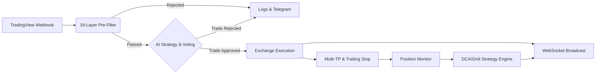

# 📡 QuantPilot AI 

   

**QuantPilot AI** is a production-grade cryptocurrency quantitative trading integration platform. It combines TradingView's Webhook signal mechanism and advanced filtering rules with powerful AI models (OpenAI GPT-4o, Anthropic Claude 3.5 Sonnet, DeepSeek, Mistral, **OpenRouter 100+ models**, or custom LLMs) to perform secondary artificial intelligence decision-making. Finally, it automates order placement and execution on mainstream crypto exchanges like Binance and OKX.

**NEW in v4.6**: Enhanced risk validation (SL/TP distance + R:R ratio), per-ticker concurrency locks, liquidity sweep analysis, dynamic volatility-based SL adjustment, smart black swan handling (profit→trail, loss→close), correlation risk control, reverse signal auto-processing, intelligent AI fallback strategy.

**NEW in v4.5**: Login brute-force protection, AI cost tracking, position conflict detection, voting timeout control, automated daily backups, Telegram i18n notifications, Nginx reverse proxy template, and full content page i18n coverage.

---

## ✨ Core Features

- **🤖 Invincible AI Trading Analysis Pipeline**
  - Built-in integration with OpenAI (GPT-4o), Anthropic (Claude 3.5 Sonnet), DeepSeek, and custom endpoints.
  - **OpenRouter** - Access 100+ models via single API (GPT-4o, Claude, Gemini, Llama 3.1, Mistral, Qwen).
  - **Multi-Model Voting** - Combine multiple AI providers for robust decisions. Strategies: weighted, consensus, best-confidence.
  - AI performs secondary risk assessment, identifies false breakouts, recommends optimal TP/SL.
  - **NEW**: Intelligent fallback strategy when AI API fails (ATR/RSI-based analysis).
  - **NEW**: Liquidity sweep analysis (pools, vacuums, false breakout detection).
  - **NEW**: Reverse signal handling (auto-close opposite position before opening new).

- **🛡️ 26-Layer Pre-Filter System**
  - Strict Webhook signal processor preventing entries during whale manipulation/black swan events.
  - Circuit breakers for max daily trades and drawdown.
  - Whale activity monitoring (Whale Alert, Etherscan, Blockchain.com).
  - NEW: Macro events, liquidation heatmap, long/short ratio, CVD divergence, basis check, fear/greed, volatility regime.

- **🧪 Backtest Engine (NEW)**
  - 3 built-in strategies: Simple Trend (EMA), SMC Trend (FVG+OB), AI Assistant (Multi-indicator).
  - 25+ performance metrics: Sharpe, Sortino, CAGR, Kelly, Max Drawdown, Profit Factor.
  - Full Trailing Stop simulation: Moving, Breakeven, Step, Profit-%.
  - Multi-TP execution with partial close simulation.
  - Strategy comparison for benchmarking.

- **📊 DCA Strategy (NEW)**
  - Average Down / Average Up modes.
  - 4 sizing methods: Fixed, Martingale, Geometric, Fibonacci.
  - Configurable activation loss threshold.
  - Auto-monitoring with interval control.
  - Full position lifecycle tracking.

- **🔲 Grid Trading (NEW)**
  - Neutral / Long Bias / Short Bias modes.
  - Arithmetic / Geometric spacing.
  - Auto range calculation based on current price.
  - Auto grid replenishment on price movement.
  - Buy/Sell pair PnL tracking.

- **⚡ WebSocket Real-time Streaming (NEW)**
  - `/ws/positions` - Real-time position updates with PnL.
  - `/ws/prices` - Live price streaming for subscribed tickers.
  - `/ws/system` - Admin system status monitoring.
  - Auto ping/pong heartbeat, channel subscription.

- **💸 Robust Multi-Tenant Architecture & Crypto Payment System**
  - JWT session control with user dashboards and admin panel.
  - Multi-chain USDT verification (TRC20, ERC20, BEP20, Solana), invite codes, subscription plans.

- **⚡ Multi-Exchange Live & Paper Trading Engine**
  - Binance, OKX, Bybit, Bitget, Gate.io, Coinbase support.
  - Paper trading, sandbox/testnet, live trading modes.
  - Realistic fees - Maker 0.02%, Taker 0.05% for accurate PnL.

- **🎯 Smart Tiered Risk Management & Trailing Stops**
  - Up to 4 TP levels (TP1-TP4) with configurable distances and close percentages.
  - 5 trailing stop modes: Moving, Breakeven-on-TP1, Step, Profit-%, Static.
  - **NEW**: SL/TP distance validation (min/max based on ATR).
  - **NEW**: R:R ratio validation (TP1 ≥ 1.5:1, avg TP ≥ 1.2:1).
  - **NEW**: Correlation risk control (max same-direction positions & exposure).
  - **NEW**: Black swan smart handling (profit→trail, loss→close).
  - **NEW**: Dynamic volatility-based SL adjustment.

- **📈 K-line Charts (NEW)**
  - Chart.js dashboard chart backed by authenticated market-data APIs.
  - Multi-timeframe: 1m, 5m, 15m, 1h, 4h, 1d.
  - REST refresh for OHLCV, realtime price, indicators, and marker data.
  - Position and signal marker lists beside the chart.

- **🎨 Strategy JSON Editor (NEW)**
  - Template-based custom strategy configuration.
  - JSON editing for entry/exit conditions, risk, TP levels, and trailing stop.
  - Save, edit, activate/deactivate, and delete strategies from the dashboard.
  - Backend export/import endpoints for strategy templates.

- **🌐 Social Signal Sharing (NEW)**
  - Share trading signals to community.
  - Subscribe to top performers.
  - Signal performance leaderboard.

- **📱 Mobile PWA Support (NEW)**
  - Progressive Web App for iOS/Android.
  - Service worker cache and offline trade-history sync.
  - Offline mode for viewing history.
  - Responsive touch-friendly UI.
  - Push event handlers are present; push subscription/delivery still requires a notification provider integration.

- **🌍 Multi-language i18n (NEW)**
  - English, Chinese, Japanese, Korean, Spanish.
  - Browser language detection and dashboard/public page language selector.
  - Language preference stored in the browser; the user-language API reports the selected language but does not yet persist it to the user record.

- **📱 Real-time Telegram Notifications**
  - Pipeline events broadcast to Telegram Bot.

---

**Performance Metrics**:
```
- Total Return %
- Win Rate
- Profit Factor
- Sharpe Ratio
- Sortino Ratio
- Max Drawdown
- CAGR
- Kelly Fraction
- Expectancy
- Recovery Factor
```

### DCA (Dollar Cost Average) Strategy
Automated position averaging with intelligent sizing:
- **Average Down**: Add to position as price drops
- **Average Up**: Add to position as price rises
- **Sizing Methods**: Fixed, Martingale (1.5x), Geometric, Fibonacci

Example DCA config:
```json
{
  "ticker": "BTCUSDT",
  "direction": "long",
  "max_entries": 5,
  "entry_spacing_pct": 2.0,
  "sizing_method": "martingale",
  "stop_loss_pct": 10.0,
  "take_profit_pct": 5.0
}
```

### Grid Trading
Profit from price oscillation within a range:
- **Neutral Grid**: Equal buy/sell distribution
- **Long Grid**: More buy levels below current price
- **Short Grid**: More sell levels above current price

Example Grid config:
```json
{
  "ticker": "BTCUSDT",
  "grid_count": 10,
  "grid_spacing_pct": 1.0,
  "total_capital_usdt": 1000,
  "spacing_mode": "arithmetic"
}
```

### WebSocket Streaming
Real-time data without polling:
- **Positions**: `ws://localhost:8000/ws/positions?token=<jwt>`
- **Prices**: `ws://localhost:8000/ws/prices?token=<jwt>`
- **System**: `ws://localhost:8000/ws/system?token=<jwt>` (admin only)

Message format:
```json
{
  "type": "position_update",
  "position_id": "pos123",
  "ticker": "BTCUSDT",
  "pnl_pct": 5.2,
  "timestamp": "2024-01-01T12:00:00Z"
}
```

---

## 🏗️ Architecture & Signal Lifecycle



---

## 🚀 Quick Start Guide

### 1. Prerequisites
- **Python 3.10+ 64-bit** (Python 3.12 64-bit is recommended for local installs; avoid 32-bit Windows Python because exchange dependencies such as `ccxt` may fail to build)
- **Docker & Docker Compose** (Recommended)
- TradingView account (Any tier)

### 2. Local Deployment

```bash
git clone https://github.com/ikun52012/QuantPilot-AI.git
cd QuantPilot-AI

pip install -r requirements.txt
cp .env.example .env
nano .env  # Configure API keys

uvicorn app:app --host 0.0.0.0 --port 8000
```

### 3. Docker Deployment

Production compose defaults to the published GHCR image:

```bash
docker compose pull
docker compose up -d
```

The admin panel one-click update feature requires:
- `signal-server` running from `ghcr.io/ikun52012/quantpilot-ai`
- the bundled `updater` service running
- `/var/run/docker.sock` mounted into the updater sidecar

For local development from source, keep using `docker build` or `uvicorn` directly. In that mode,
the admin page still supports update checking, but rollout stays manual.

```bash
docker-compose up -d --build
docker-compose logs -f
```

### 4. Database Migration

```bash
# Apply the bundled migrations
alembic upgrade head
```

**Default Login**:
```
Username: admin
Password: read data/bootstrap_admin_password.txt if DEFAULT_ADMIN_PASSWORD is blank
```

On first deployment, leaving `DEFAULT_ADMIN_PASSWORD` blank creates a random bootstrap password in
`data/bootstrap_admin_password.txt`. If you set `DEFAULT_ADMIN_PASSWORD` yourself, use that value.
Change the admin password and set a strong `JWT_SECRET` immediately.

---

## ⚙️ API Reference

### Backtest API

| Endpoint | Method | Description |
|----------|--------|-------------|
| `/api/backtest/run` | POST | Run backtest simulation |
| `/api/backtest/strategies` | GET | List available strategies |
| `/api/backtest/compare` | GET | Compare all strategies |

### DCA Strategy API

| Endpoint | Method | Description |
|----------|--------|-------------|
| `/api/strategies/dca/create` | POST | Create DCA position |
| `/api/strategies/dca/list` | GET | List active DCA |
| `/api/strategies/dca/check/{id}` | POST | Check & execute DCA |
| `/api/strategies/dca/close/{id}` | DELETE | Close DCA position |

### Grid Strategy API

| Endpoint | Method | Description |
|----------|--------|-------------|
| `/api/strategies/grid/create` | POST | Create grid |
| `/api/strategies/grid/list` | GET | List active grids |
| `/api/strategies/grid/check/{id}` | POST | Check & execute grid |
| `/api/strategies/grid/close/{id}` | DELETE | Close grid |

### WebSocket API

| Endpoint | Description |
|----------|-------------|
| `/ws/positions` | Position updates stream |
| `/ws/prices` | Price streaming |
| `/ws/system` | System status (admin) |

---

## 📬 TradingView Webhook

Minimal payload:
```json
{
  "secret": "your-webhook-secret",
  "ticker": "{{ticker}}",
  "exchange": "{{exchange}}",
  "direction": "long",
  "price": {{close}},
  "timeframe": "{{interval}}",
  "strategy": "{{strategy.order.comment}}"
}
```

---

## 🧪 Running Tests

```bash
# Install test dependencies
pip install pytest pytest-asyncio httpx

# Run all tests
pytest tests/ -v

# Run specific test files
pytest tests/test_backtest_engine.py -v
pytest tests/test_strategies.py -v
pytest tests/test_websocket.py -v
pytest tests/test_voting.py -v
pytest tests/test_trailing_stop.py -v
pytest tests/test_smc.py -v
```

---

## 🌐 Internationalization

Supported languages:
- 🇺🇸 English (default)
- 🇨🇳 中文
- 🇯🇵 日本語
- 🇰🇷 한국어
- 🇪🇸 Español

Use the language selector on the public pages or dashboard. The frontend stores the selection in
browser `localStorage` and loads translations from `/api/i18n/public/translations/{language}` before
login, then from `/api/i18n/translations/{language}` after login.

---

## 📱 Mobile PWA

Access from mobile:
1. Open `https://your-domain` in mobile browser
2. Tap "Add to Home Screen"
3. App installs as PWA with cached static assets and offline history sync

---

## 🛡️ Security Features

- **HMAC Verification**: Production mode requires webhook signature
- **JWT Session Cookies**: HTTP-only session cookies with CSRF protection
- **Rate Limiting**: IP-based sliding window protection
- **CSRF Tokens**: Double-submit cookie validation
- **Encrypted Secrets**: AES-256 encryption for sensitive data
- **Audit Logging**: All admin actions recorded
- **Session Versioning**: Immediate revoke on password change

---

## 🛠️ Troubleshooting

| Issue | Solution |
|-------|----------|
| Database Locks | Use PostgreSQL for high load |
| AI Timeout | Increase `AI_READ_TIMEOUT_SECS` |
| WebSocket Disconnect | Check JWT token validity |
| Grid Out of Range | Enable auto-replenish |
| DCA Max Capital | Check `max_total_capital_usdt` |

---

## 🛡️ Disclaimer

**Automated trading involves extreme risk.** This project is a routing hub and AI tool, not financial advice. Developers assume no liability for losses. Always test with `LIVE_TRADING=false` first.

> *All Trading Involves Absolute Risk. Code your own destiny.* ☕
