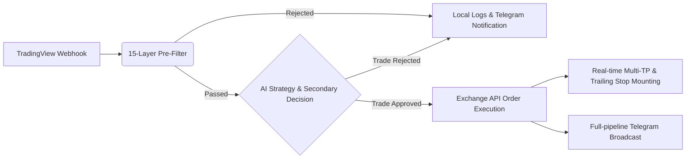

# 馃摗 QuantPilot AI (v4.1)

   

**QuantPilot AI** is a production-grade cryptocurrency quantitative trading integration platform. It combines TradingView's Webhook signal mechanism and advanced filtering rules with powerful AI models (OpenAI GPT, Anthropic Claude, DeepSeek, or custom LLMs) to perform secondary artificial intelligence decision-making. Finally, it automates order placement and execution on mainstream crypto exchanges like Binance and OKX.

This system is equipped with a stunning "Midnight Glassmorphism" interactive frontend dashboard. It features a complete multi-tenant/multi-user role-based access control system and a USDT subscription payment pipeline, making it ready to be deployed commercially as a complete SaaS quantitative advisory platform.

---

## 鉁?Core Features

- **馃 Invincible AI Trading Analysis Pipeline**
  - Built-in integration with OpenAI (GPT-4o), Anthropic (Claude 3.5 Sonnet), DeepSeek, and supports fully custom OpenAI-compatible endpoints.
  - The AI performs secondary risk assessment based on market depth and direction context, identifying false breakouts and choppy markets. It automatically recommends optimal take-profit tiers and adaptive stop-loss points.
- **馃洝锔?15-Layer Pre-Filter System**
  - Features an extremely strict preliminary Webhook signal processor to prevent entries during malicious market conditions like whale manipulation or black swan high-volatility events.
  - Supports circuit breakers for maximum daily trades and maximum daily account drawdown.
- **馃捀 Robust Multi-Tenant Architecture & Crypto Payment System**
  - Complete and secure JWT session control with independent user dashboards and a global Super Admin Dashboard.
  - Create and manage paid subscription plans. Features built-in multi-chain USDT transaction hash verification (TRC20, ERC20, BEP20, Solana, etc.), invite codes, and a free-trial ecosystem for a closed-loop business model.
- **鈿?Multi-Exchange Live & Paper Trading Engine (Powered by ccxt)**
  - Out-of-the-box support for Binance, OKX, Bybit, Bitget, Gate.io, and Coinbase.
  - Fully controlled via environment variables, the admin dashboard, or individual user settings for Local Paper Trading, Exchange Sandbox/Testnet Trading, and Live Trading.
- **馃幆 Smart Tiered Risk Management & Trailing Stops (Multi-TP)**
  - Customize up to 4 sequential stages (TP1 to TP4) of tiered position closing to secure bounce profits.
  - In-house developed smart trailing stop module that steps up the hard stop-loss based on percentage steps, letting your profits run.
- **馃摫 Real-time Telegram Notifications**
  - From receiving a signal, triggering pre-filter blocks, AI smart analysis, to exchange order execution, all pipeline events are broadcasted in real-time to your Telegram Bot.

---

## 馃彈锔?Architecture & Signal Lifecycle



---

## 馃帹 Cutting-edge Interactive Dashboard (Midnight Glassmorphism)

We've completely overhauled the "boring financial backend" stereotype. The dashboard implements a **Midnight Glassmorphism** design aesthetic:
- **Deep, dreamy cyberpunk abyss interface** paired with dynamic colorful micro-animation particles, showcasing your quant-geek taste.
- **Spotlight Hover micro-interaction system**.
- Seamless real-time responsive modern UI (mobile and web compatible) for maximum operational comfort.

---

## 馃殌 Quick Start Guide

### 1. Prerequisites
Before starting your money-making machine, ensure your server terminal has the following:
- **Python 3.10+**
- **Docker & Docker Compose** (Recommended deployment method).
- A TradingView account (Any tier, but paid tiers are recommended to create Webhooks).

Use **Python 3.10+** for local installs. Docker uses Python 3.12 by default and is the recommended path on Windows, especially if your local machine only has a 32-bit Python interpreter.

### 2. Local Source Deployment (For Custom Development)

```bash
# 1. Clone the repository
git clone https://github.com/your-organization/signal-server.git
cd signal-server

# 2. Install core Python dependencies (venv recommended)
pip install -r requirements.txt

# 3. Configure your pipeline
cp .env.example .env
nano .env # Setup API keys for Exchanges, AI, Telegram Bot, etc.

# 4. Ignite! 馃敟
uvicorn app:app --host 0.0.0.0 --port 8000
# Set UVICORN_RELOAD=true only for local auto-reload development.
```
Visit `http://0.0.0.0:8000` locally or on your LAN to access the quant dashboard!

Open:

- Homepage: `http://localhost:8000/`
- Login: `http://localhost:8000/login`
- Dashboard: `http://localhost:8000/dashboard`

Default first-deployment login:

```text
Username: admin
Password: 123456
```

**鈿狅笍 SECURITY WARNING:** The default password `123456` is intentionally weak for initial setup only. You MUST change `DEFAULT_ADMIN_PASSWORD` and `JWT_SECRET` to strong, unique values before exposing the service to the internet. Failure to do so puts your trading accounts and funds at extreme risk.

### 3. One-Click Docker Deployment
When you are ready to deploy it as a 24/7 cloud miner:

```bash
# After configuring your .env file
docker-compose up -d --build

# Monitor live terminal logs
docker-compose logs -f
```
_Note: Generated SQLite databases and critical logs will be persistently mapped to `./data` and `./logs`. If you encounter permission errors on Linux host machines, run `chmod -R 777 ./data ./logs` to allow the internal `appuser` container user to write._

---

## 鈿欙笍 Core `.env` Configuration Guide

Here are the high-frequency variables you must pay attention to:
*   **`AI_PROVIDER`**: Model integration base. Valid fields are `openai`, `anthropic`, `deepseek`, or `custom` for your own base (if `custom`, ensure you fill out the related custom fields below it).
*   **`EXCHANGE`**: Default platform egress, like `binance`. If operating as a SaaS provider, tenant users can also enter their own Exchange Keys in their web dashboard.
*   **`LIVE_TRADING`**: Critical! Keep `false` for Local Paper Trading. Set `true` only when you want the server to send orders through exchange APIs.
*   **`EXCHANGE_SANDBOX_MODE`**: Set to `true` together with `LIVE_TRADING=true` to route supported exchanges to testnet/sandbox endpoints. This is different from Local Paper Trading because real API calls are still sent, but to the exchange test environment.
*   **`JWT_SECRET`** & **`WEBHOOK_SECRET`**: The authorization lifelines of the entire server. **Must be set to unbreakable, random, ultra-long hashes!**
*   **`WEBHOOK_HMAC_SECRET`**: Optional strict webhook body signature secret. If set, webhook senders must include `X-TVSS-Signature: sha256=<hmac_sha256_raw_body>`.
*   **`DEFAULT_ADMIN_PASSWORD`**: The default super-admin password generated on first run (Default: 123456). Please change this immediately after your first successful login.
*   **`PREFILTER_DISABLED_CHECKS`**: Optional comma-separated list of pre-filter rule keys to bypass, for example `spread,market_hours`.
*   **`AI_READ_TIMEOUT_SECS`**: AI provider read timeout. Default is 90 seconds for larger prompts and congested model providers.

---

## 馃摤 TradingView Webhook Integration

1. Craft your high-win-rate strategy chart in TradingView.
2. Open the "Create Alert" dialog.
3. Under the Notifications tab, check `Webhook URL` -> Enter your HTTPS endpoint, for example `https://<your-domain>/webhook`.
4. The "Message" box requires a structured JSON Payload. To view your specific authenticated Payload template, please log into the platform and check your User Settings dashboard.

Minimal long signal:

```json
{
  "secret": "copy-from-dashboard",
  "ticker": "{{ticker}}",
  "exchange": "{{exchange}}",
  "direction": "long",
  "price": {{close}},
  "timeframe": "{{interval}}",
  "strategy": "{{strategy.order.comment}}",
  "message": "{{strategy.order.action}} {{ticker}} @ {{close}}",
  "bar_time": "{{time}}"
}
```

For short signals, change only `"direction": "short"`.

The server records webhook events and reserves duplicate payload fingerprints atomically in SQLite before running AI/exchange logic. This protects against TradingView retries or concurrent duplicate deliveries placing repeated orders.

---

## Production Hardening

- Runtime admin secrets, webhook secrets, and per-user exchange keys are encrypted at rest with `APP_ENCRYPTION_KEY`. If it is omitted, the app generates a persistent key in `data/app_encryption.key`; back this file up and keep the `data/` volume mounted permanently.
- Admin dashboard settings are persisted in the database and reapplied on startup. In Exchange Configuration, choose `Local Paper Trading` for no exchange orders, `Exchange API Trading + sandbox/testnet` for supported exchange demo environments, or `Exchange API Trading` without sandbox for real live orders.
- Per-user webhook lookup uses a stored hash, so the dashboard can show each user's real secret while the database index does not keep the raw value.
- Browser write APIs use a double-submit CSRF token in addition to the HttpOnly session cookie.
- Login and registration endpoints use IP sliding-window rate limits. Passwords must include lowercase, uppercase, number, and symbol characters.
- JWT sessions carry a token version. Disabling a user, changing role/active state, or resetting a password revokes older sessions immediately.
- SQLite uses WAL, foreign keys, and a busy timeout for better webhook concurrency. The current database layer remains SQLite-based; PostgreSQL is still the recommended next step for very high-volume multi-instance deployments.
- Leave `PUBLIC_BASE_URL` empty to auto-detect the current domain from request/proxy headers. Set it only if auto-detection is wrong, such as `https://cs.hyzcjs.com` or `https://127.0.0.1`.
- Optional webhook HMAC verification is available through `WEBHOOK_HMAC_SECRET`. Normal TradingView JSON `secret` verification remains supported when HMAC is not configured.
- Set `COOKIE_SECURE=true` when deploying behind HTTPS.
- Docker Compose binds the app to `127.0.0.1:8000` by default. Expose it through Nginx, Caddy, Cloudflare Tunnel, or another HTTPS reverse proxy.
- Trade logs are written to SQLite as the source of truth while legacy JSON logs remain a best-effort readable mirror.
- A lightweight position ledger tracks open and close signals and computes realized `pnl_pct` on matching close signals, keeping each user's analytics isolated.
- Admin actions are recorded in an audit log and displayed in the Admin System panel.
- `/health` performs database, writable storage, disk-space, AI configuration, and exchange configuration checks. `/metrics` exposes basic Prometheus-style counters for operational monitoring.
- Payment TX hashes are checked for duplicate submission before admin confirmation. Admins can also run best-effort on-chain verification for TRC20, ERC20, BEP20, and Arbitrum from the Pending Payments panel. Aptos is detected but staged for manual/indexer review.
- Advanced trailing modes are monitored by a scheduled position monitor. Set `POSITION_MONITOR_INTERVAL_SECS` to tune the scan interval, and review the Position Monitor panel after enabling live trading.
- Backups can be created from the Admin Backup panel. `.env` is intentionally excluded from backup ZIP files; always keep `data/app_encryption.key` or `APP_ENCRYPTION_KEY`; encrypted secrets cannot be recovered without it.

### Commercial Operation Notes

- Each user has isolated exchange keys, webhook secret, TP settings, trade history, and performance charts.
- Admins can decide whether a user may enable live trading, plus set max leverage and max position percentage caps.
- Exchange TP/SL order parameters are tried through exchange-aware candidates. Always test each target exchange with a small paper/live pilot before trusting automation with real size.
- Webhook Diagnostics shows recent invalid secrets, duplicate alerts, pre-filter blocks, AI rejects, and executed signals so TradingView issues can be traced from the dashboard.
- For fully unattended payments, configure explorer API keys in `.env` and still keep manual review available for chain/API outages.

---

## 馃洜锔?Troubleshooting & FAQ

- **Database Locks (SQLite WAL)**: High concurrency of webhooks might occasionally cause `database is locked` errors. Ensure `data/` is on a fast SSD and consider migrating to PostgreSQL for heavy SaaS loads.
- **Port 8000 in Use**: If the server fails to start, check if another service is using port 8000 (`lsof -i :8000`). Change the port in `docker-compose.yml` or the `uvicorn` startup command.
- **AI Timeout Errors**: If GPT-4 or Claude takes too long to respond, increase `AI_READ_TIMEOUT_SECS` (default 90) in your `.env` file.
- **Supported Payment Chains**: The built-in scanner supports TRC20, ERC20, BEP20, and Arbitrum. Ensure you configure the respective block explorer API keys (e.g., TronGrid, Etherscan) in the `.env` file for automatic verification.

---

## 馃洝锔?Disclaimer & Risk Warning

**Please review this declaration carefully before launching:**
Deploying and running automated quantitative trading for futures or spot markets is an **extremely high-risk operation**. This project serves as an open structured routing hub and AI empowerment tool. All commands executed through this tool **do not constitute, nor are they equivalent to, any financial or investment advice**. The developers and contributors of this codebase **assume no liability whatsoever** for any asset liquidations, slippage blowouts, or total capital losses caused by exchange API outages, network jitter, or rare AI hallucinations. We strongly advise all users to maintain long-term paper trading using `LIVE_TRADING=false` before injecting real capital.

> *All Trading Involves Absolute Risk. Code your own destiny.* 鈽?
