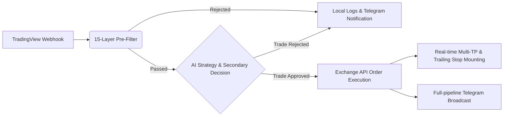

# 📡 TradingView AI Signal Server (v4.0)

   

**TradingView Signal Server** is a production-grade cryptocurrency quantitative trading integration platform. It combines TradingView's Webhook signal mechanism and advanced filtering rules with powerful AI models (OpenAI GPT, Anthropic Claude, DeepSeek, or custom LLMs) to perform secondary artificial intelligence decision-making. Finally, it automates order placement and execution on mainstream crypto exchanges like Binance and OKX.

This system is equipped with a stunning "Midnight Glassmorphism" interactive frontend dashboard. It features a complete multi-tenant/multi-user role-based access control system and a USDT subscription payment pipeline, making it ready to be deployed commercially as a complete SaaS quantitative advisory platform.

---

## ✨ Core Features

- **🤖 Invincible AI Trading Analysis Pipeline**
  - Built-in integration with OpenAI (GPT-4o), Anthropic (Claude 3.5 Sonnet), DeepSeek, and supports fully custom OpenAI-compatible endpoints.
  - The AI performs secondary risk assessment based on market depth and direction context, identifying false breakouts and choppy markets. It automatically recommends optimal take-profit tiers and adaptive stop-loss points.
- **🛡️ 15-Layer Pre-Filter System**
  - Features an extremely strict preliminary Webhook signal processor to prevent entries during malicious market conditions like whale manipulation or black swan high-volatility events.
  - Supports circuit breakers for maximum daily trades and maximum daily account drawdown.
- **💸 Robust Multi-Tenant Architecture & Crypto Payment System**
  - Complete and secure JWT session control with independent user dashboards and a global Super Admin Dashboard.
  - Create and manage paid subscription plans. Features built-in multi-chain USDT transaction hash verification (TRC20, ERC20, BEP20, Solana, etc.), invite codes, and a free-trial ecosystem for a closed-loop business model.
- **⚡ Multi-Exchange Live & Paper Trading Engine (Powered by ccxt)**
  - Out-of-the-box support for Binance, OKX, Bybit, Bitget, Gate.io, and Coinbase.
  - Fully controlled via environment variables or individual user settings for Paper Trading (local simulated records) and Live Trading (high-concurrency real order placements).
- **🎯 Smart Tiered Risk Management & Trailing Stops (Multi-TP)**
  - Customize up to 4 sequential stages (TP1 to TP4) of tiered position closing to secure bounce profits.
  - In-house developed smart trailing stop module that steps up the hard stop-loss based on percentage steps, letting your profits run.
- **📱 Real-time Telegram Notifications**
  - From receiving a signal, triggering pre-filter blocks, AI smart analysis, to exchange order execution, all pipeline events are broadcasted in real-time to your Telegram Bot.

---

## 🏗️ Architecture & Signal Lifecycle



---

## 🎨 Cutting-edge Interactive Dashboard (Midnight Glassmorphism)

We've completely overhauled the "boring financial backend" stereotype. The dashboard implements a **Midnight Glassmorphism** design aesthetic:
- **Deep, dreamy cyberpunk abyss interface** paired with dynamic colorful micro-animation particles, showcasing your quant-geek taste.
- **Spotlight Hover micro-interaction system**.
- Seamless real-time responsive modern UI (mobile and web compatible) for maximum operational comfort.

---

## 🚀 Quick Start Guide

### 1. Prerequisites
Before starting your money-making machine, ensure your server terminal has the following:
- **Python 3.10+**
- **Docker & Docker Compose** (Recommended deployment method).
- A TradingView account (Any tier, but paid tiers are recommended to create Webhooks).

### 2. Local Source Deployment (For Custom Development)
```bash
# 1. Clone the repository
git clone https://github.com/your-organization/signal-server.git
cd signal-server

# 2. Install core Python dependencies (venv recommended)
pip install -r requirements.txt

# 3. Configure your pipeline
cp .env.example .env
nano .env # Setup API keys for Exchanges, AI, Telegram Bot, etc.

# 4. Ignite! 🔥
uvicorn main:app --host 0.0.0.0 --port 8000
```
Visit `http://0.0.0.0:8000` locally or on your LAN to access the quant dashboard!

### 3. One-Click Docker Deployment
When you are ready to deploy it as a 24/7 cloud miner:
```bash
# After configuring your .env file
docker-compose up -d --build

# Monitor live terminal logs
docker-compose logs -f
```
_Note: Generated SQLite databases and critical logs will be persistently mapped to `./data` and `./logs`._

---

## ⚙️ Core `.env` Configuration Guide

Here are the high-frequency variables you must pay attention to:
*   **`AI_PROVIDER`**: Model integration base. Valid fields are `openai`, `anthropic`, `deepseek`, or `custom` for your own base (if `custom`, ensure you fill out the related custom fields below it).
*   **`EXCHANGE`**: Default platform egress, like `binance`. If operating as a SaaS provider, tenant users can also enter their own Exchange Keys in their web dashboard.
*   **`LIVE_TRADING`**: Critical! Set to `true` for production live trading, and strictly keep it `false` for paper trading during sandbox strategy testing.
*   **`JWT_SECRET`** & **`WEBHOOK_SECRET`**: The authorization lifelines of the entire server. **Must be set to unbreakable, random, ultra-long hashes!**
*   **`DEFAULT_ADMIN_PASSWORD`**: The default super-admin password generated on first run (Default: 123456). Please change this immediately after your first successful login.

---

## 📬 TradingView Webhook Integration

1. Craft your high-win-rate strategy chart in TradingView.
2. Open the "Create Alert" dialog.
3. Under the Notifications tab, check `Webhook URL` -> Enter `http://<your_server_ip_or_domain>:8000/webhook`.
4. The "Message" box requires a structured JSON Payload. To view your specific authenticated Payload template, please log into the platform and check your User Settings dashboard.

---

## 🛡️ Disclaimer & Risk Warning

**Please review this declaration carefully before launching:**
Deploying and running automated quantitative trading for futures or spot markets is an **extremely high-risk operation**. This project serves as an open structured routing hub and AI empowerment tool. All commands executed through this tool **do not constitute, nor are they equivalent to, any financial or investment advice**. The developers and contributors of this codebase **assume no liability whatsoever** for any asset liquidations, slippage blowouts, or total capital losses caused by exchange API outages, network jitter, or rare AI hallucinations. We strongly advise all users to maintain long-term paper trading using `LIVE_TRADING=false` before injecting real capital.

> *All Trading Involves Absolute Risk. Code your own destiny.* ☕
