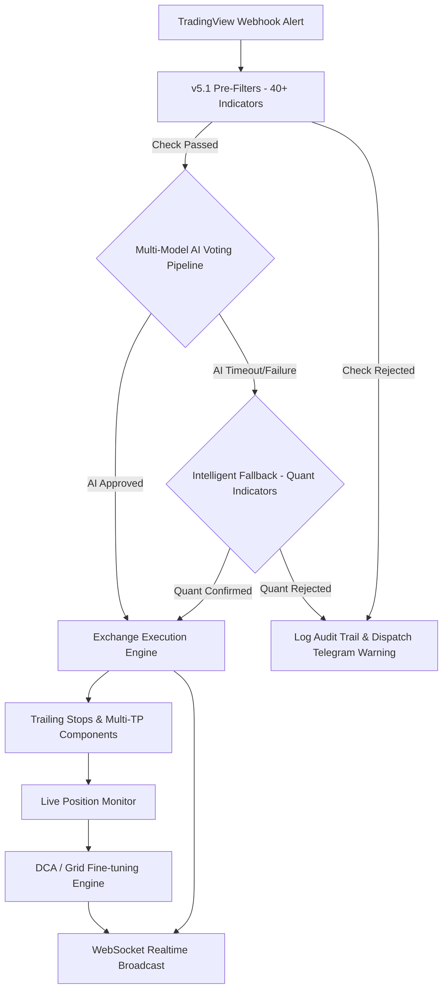

# 📡 QuantPilot AI — Intelligent Quantitative Trading Integration & Execution System

<div align="center">


**QuantPilot AI** is a production-grade cryptocurrency quantitative trading integration and execution platform. It seamlessly combines TradingView's Webhook alert mechanism, a highly institutional **v5.1 Pre-Filter engine (40+ weighted checks)**, and **Smart Money Concepts (SMC/FVG) market structure analysis** with advanced AI voting pipelines (supporting OpenAI GPT-4o, Anthropic Claude 3.5 Sonnet, DeepSeek, Mistral, and **OpenRouter 100+ models**) to perform secondary risk assessment and entry timing optimization. It then automates order execution on mainstream global crypto exchanges (e.g., Binance, OKX, Bybit).

[English](./README_EN.md) | [中文说明文档](./README.md)

</div>

---

## 🚀 What's New

### 🆕 v5.1 Institutional-Grade Indicators & Fail-Closed Gate
- **Institutional Indicator Filters**: Added VWAP deviation checks, Open Interest (OI) vs. price divergence/stall detection, exchange reserves flow monitoring, funding rate term structure multiplier limits, and cross-exchange price discrepancy arbitrage validation.
- **Fail-Closed Live Trading Gate**: In live-trading mode, any data quality drops or risk-check errors immediately trip a "fail-closed" safe gate to prevent unauthorized risk exposure.
- **Decision Audit Trail**: Full end-to-end audit logging tracking every signal from Webhook trigger, through pre-filters, AI voting, to final exchange execution.
- **Stricter Risk Validation**: Implemented rigid SL/TP distance checks, dynamic volatility-based SL scaling (ATR-based), and absolute minimum Risk-Reward (R:R) ratio enforcement.
- **Concurrency Locks & Exposure Controls**: Per-ticker process locks to prevent signal duplication, plus high-correlation asset direction/exposure caps and reverse-signal auto-liquidation.

### 🆕 v5.0 Modulized Admin Dash & Adaptive Throttling
- **Dedicated Admin Control Panel**: Split into dedicated tabs for **Pre-Filter Configuration**, **Scanner & Signals**, and **Audit Logs**.
- **2-Phase Loading & Throttling**: Administrative API calls are optimized with 2-phase lazy loading and request throttling to avoid network timeouts under high concurrency.
- **Intelligent Fallback Strategy**: When AI APIs time out or throw errors, the system automatically falls back to classical ATR/RSI/SMC indicators to continue operations uninterrupted.
- **Automated Operations**: Added automatic daily database backups and Telegram internationalization (i18n) notifications.

---

## ✨ Core Features

### 1. 🤖 Intelligent AI Voting Pipeline
- **Multi-Provider Ecosystem**: Native integration with OpenAI, Anthropic, DeepSeek, and custom API endpoints.
- **OpenRouter Gateway**: Single API key to query 100+ state-of-the-art models (Llama 3.1, Qwen, Gemini, Mistral, etc.).
- **Consensus & Multi-Voting**: Weighted voting, full consensus, and confidence-priority selection models to mitigate model hallucinations and biases.
- **SMC/FVG Helper**: Built-in Smart Money Concepts analyzer highlighting Fair Value Gaps (FVGs), Order Blocks (OBs), and Market Structure Breaks (BOS/CHoCH) to seek optimal entries within Premium/Discount zones.

### 2. 🛡️ 40+ Pre-Filter Risk Layers
Before dispatching a signal to high-cost AI models, a highly optimized rule-based engine tests:
- **Liquidity & Spread Safeguard**: Blocks entry during holiday/weekend liquidity drops, massive volume spikes/crashes, or extreme spreads.
- **System Kill Switches**: Max daily trade caps, drawdown circuit breakers, and signal velocity rate-limiters.
- **On-chain Whale Tracking**: Connects to large whale alert streams to avoid black swan events.
- **Market Divergence**: CVD divergence, liquidation heatmaps, long/short ratio, basis discrepancies, and market volatility regimes.

### 3. 🧪 Production Simulation & Backtesting
- Three built-in backtesting strategies: **EMA Trend Follower**, **SMC Core (FVG+OB)**, and **AI-Assisted Analysis**.
- Generates 25+ institutional metrics: Sharpe Ratio, Sortino Ratio, CAGR, Max Drawdown, Kelly Fraction, Profit Factor, etc.
- Realistic Multi-Take Profit (TP1-TP4) partial exits and trailing stop models.

### 4. 📊 DCA & Grid Trading Engines
- **DCA Strategy**: Support for both Average Down and Average Up styles. Offers 4 sizing algorithms: Fixed Amount, Martingale multiplier (e.g. 1.5x), Geometric scaling, and Fibonacci ordering.
- **Grid Trading**: Neutral, Long Bias, and Short Bias grid spacing (Arithmetic or Geometric), with auto-replenishment on price breakouts.

### 5. ⚡ Live WebSocket Streaming
- `/ws/positions`: Ultra-fast position updates and dynamic unrealized PnL streaming.
- `/ws/prices`: Microsecond realtime pricing updates for subscribed pairs.
- `/ws/system`: Realtime CPU, memory, and database connection metrics (Admin only).

### 6. 💸 Multi-Tenant & USDT Crypto Payments
- Built-in JWT + HttpOnly Cookie session controls, featuring complete user dashboard and admin panels.
- Automated multi-chain (TRC20, ERC20, BEP20, Solana) USDT verification system with invite codes and subscription plans.

---

## DCA & Grid Configurations

### DCA Strategy Config Example
```json
{
  "ticker": "BTCUSDT",
  "direction": "long",
  "max_entries": 5,
  "entry_spacing_pct": 2.0,
  "sizing_method": "martingale",
  "stop_loss_pct": 10.0,
  "take_profit_pct": 5.0
}
```

### Grid Trading Config Example
```json
{
  "ticker": "ETHUSDT",
  "grid_count": 10,
  "grid_spacing_pct": 1.0,
  "total_capital_usdt": 1000,
  "spacing_mode": "arithmetic"
}
```

---

## 🏗️ Architecture & Signal Lifecycle



---

## 🚀 Quick Start

### 1. Prerequisites
- **Python 3.10+ 64-bit** (Python 3.12 64-bit is strongly recommended to compile CCXT and other native exchange libraries successfully; avoid 32-bit Windows Python).
- **Docker & Docker Compose** (Recommended for production).
- TradingView account (free or paid).

### 2. Local Setup

```bash
# 1. Clone Repo
git clone https://github.com/ikun52012/QuantPilot-AI.git
cd QuantPilot-AI

# 2. Install Dependencies (Virtual Env recommended)
python -m venv venv
source venv/bin/activate  # Linux/macOS
# Windows PowerShell: .\venv\Scripts\Activate.ps1

pip install -r requirements.txt

# 3. Environment Config
cp .env.example .env
# Generate a strong JWT_SECRET and add it to .env
python -c "import secrets; print(secrets.token_hex(32))"

# 4. Run Alembic Database Migrations
alembic upgrade head

# 5. Start Server
python -m uvicorn app:app --host 0.0.0.0 --port 8000
```

### 3. Docker Deployment

Production environments utilize published images on GHCR by default:

```bash
# Pull latest images
docker compose pull
# Start all containers in background
docker compose up -d
```

> [!NOTE]
> If you plan to use the "One-click Update" feature from the Admin panel, make sure to mount `/var/run/docker.sock` to the `updater` container.

---

## ⚙️ Environment Variables (.env)

| Variable | Description | Example |
|---|---|---|
| `DATABASE_URL` | Database Connection String (PostgreSQL recommended for production) | `sqlite+aiosqlite:///./data/server.db` |
| `JWT_SECRET` | JWT Sign Key (32-byte hex string) | Created with `openssl rand -hex 32` |
| `WEBHOOK_SECRET` | Secret to authenticate TradingView alerts | Custom secure string |
| `LIVE_TRADING` | **Master live trading switch** (must be true to trade) | `false` (default) |
| `EXCHANGE` | Execution exchange destination | `binance` / `okx` / `bybit` |
| `EXCHANGE_API_KEY` | Exchange API Key | `your_api_key` |
| `EXCHANGE_API_SECRET` | Exchange API Secret | `your_api_secret` |
| `AI_PROVIDER` | Decision AI service provider | `openrouter` / `deepseek` / `openai` |
| `OPENROUTER_API_KEY` | OpenRouter API Key (if using OpenRouter) | `sk-or-v1-xxx` |
| `TELEGRAM_BOT_TOKEN` | Bot token for Telegram alerts | `xxx:xxx` |

**Admin Credentials**:
- Username: `admin`
- Password: If `DEFAULT_ADMIN_PASSWORD` in `.env` is empty, the system generates a random key on the first boot inside `data/bootstrap_admin_password.txt`. Please change this password and register your TOTP 2FA immediately.

---

## ⚙️ Core API Endpoints

### 📊 Backtest API
- `POST /api/backtest/run` : Run historical simulations.
- `GET /api/backtest/strategies` : List available strategy templates.
- `GET /api/backtest/compare` : Compare multi-strategy historical yields.

### 📈 Strategy API
- `POST /api/strategies/dca/create` : Spawn a Dollar Cost Averaging task.
- `POST /api/strategies/grid/create` : Initialize a Grid trading profile.
- `DELETE /api/strategies/dca/close/{id}` : Tear down and liquidate a DCA task.

---

## 📬 TradingView Webhook Format

Set your TradingView alert Webhook URL to `https://your-domain.com/api/webhook` and paste the following standard JSON payload:

```json
{
  "secret": "WEBHOOK_SECRET_configured_in_env",
  "ticker": "{{ticker}}",
  "exchange": "{{exchange}}",
  "direction": "long",
  "price": {{close}},
  "timeframe": "{{interval}}",
  "strategy": "SMC-Breakout-V1"
}
```

---

## 🧪 Testing

We supply full unit and integration test coverage:

```bash
# Install test suites
pip install pytest pytest-asyncio httpx

# Run all test cases
pytest tests/ -v

# Run individual test files
pytest tests/test_backtest_engine.py -v
pytest tests/test_strategies.py -v
pytest tests/test_websocket.py -v
pytest tests/test_voting.py -v
```

---

## 🛡️ Security & Compliance Checklist

Complete these security items before deployment:
- [x] **Secret Rotation**: Change default `JWT_SECRET` and `WEBHOOK_SECRET` keys.
- [x] **Network isolation**: Bind FastAPI to local boundaries and use an Nginx reverse proxy to restrict administrative API exposure.
- [x] **Live verification**: Run simulation trades (`LIVE_TRADING=false`) for at least 1 month before turning on live API parameters.
- [x] **Multi-factor auth**: Secure all administrator records with TOTP Google Authenticator.
- [x] **Logs rotation**: Configure offsite backups of `logs/` and `trade_logs/` directories to prevent tamper risk.

---

## 🛡️ Disclaimer

**Automated quantitative trading involves extreme financial risk.** QuantPilot AI is a routing hub, rule-based filtering layer, and AI-assisted decision tool. All data, backtests, and AI recommendations are not financial advice. Developers and contributors accept no liability for any losses caused by system outages, model hallucinations, database locks, or API disruptions. **Trade at your own risk.**

> *All Trading Involves Absolute Risk. Code your own destiny.* ☕
