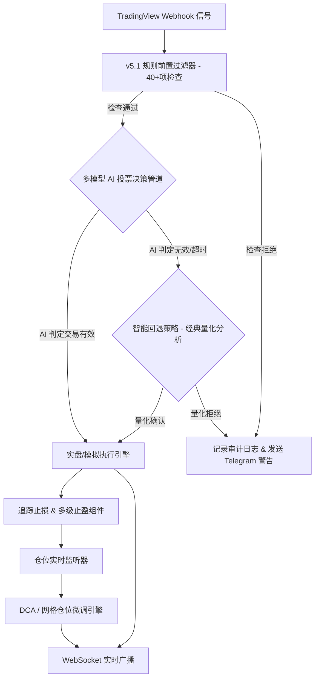

# 📡 QuantPilot AI — 智能量化交易决策与执行系统

<div align="center">


**QuantPilot AI** 是一款工业级（Production-Grade）加密货币量化交易集成与决策执行平台。系统将 TradingView 的 Webhook 信号机制、极为苛刻的 **v5.4 交易所感知扫描器与前置过滤栈**、**智能资金概念 (SMC/FVG) 市场结构分析** 与先进的 AI 决策管道（支持 OpenAI GPT-4o, Anthropic Claude 3.5 Sonnet, DeepSeek, Mistral 以及 **OpenRouter 100+ 种模型**）完美结合，进行二次智能风控决策与入场点优化，并在全球主流加密货币交易所（如 Binance, OKX, Bybit 等）实现全自动订单执行。

[English](./README.md) | [中文说明文档](./README_ZH.md)

</div>

---

## 🚀 最新特性

### 🆕 v5.4 交易所感知扫描池
- **全可交易默认值**：Watchlist 留空时扫描目标交易所全部可交易品种；Live Whitelist 留空时允许 live universe snapshot 内全部品种。
- **来源策略与预览**：支持 manual、follow_exchange、custom_exchange、hybrid，并提供 strict/fallback/confirm 数据源策略与干跑预览。
- **来源健康与过滤漏斗**：加入交易所 universe 缓存、source health、流动性分层和按原因聚合的扫描漏斗诊断。

### 🆕 v5.3 机构级扫描器精准化
- **多周期共识信号**：扫描器现在按标的输出一个最终 long/short/neutral 决策，通过高周期加权共识和确认周期门槛减少互相冲突的候选信号。
- **真实结果学习与 Walk-Forward 阈值**：已关闭的扫描器交易会回写成结果标签，用真实胜负样本调整得分阈值和因子表现。
- **流动性、事件时段与组合风控门控**：在 AI 复核前加入盘口深度、估算滑点、资金费率/时段黑名单和相关资产同向暴露限制。

### 🆕 v5.2 扫描器、后台与发布链路强化
- **自动市场扫描器**：支持多周期候选融合，在 AI 复核前纳入 EMA200、HTF 冲突、VWAP/POC、持仓量、行情 Regime、ADX/MACD 和成交量确认。
- **独立后台工作区**：拆分前置过滤器、扫描器、日志和订阅管理页面，并加入限流加载与分页审计视图。
- **更安全的订单元数据**：实盘限价挂单保留 timeout 与交易所实际提交数量，提升 pending 仓位对账可靠性。

### 🆕 v5.1 机构级指标前置过滤器 & 实盘防损门控
- **机构级指标过滤**：新增 VWAP 偏离度检查、持仓量 (OI) 与价格背离/停滞检测、交易所资金储备流向监控、资金费率期限结构乘数限制、跨交易所价差套利校验。
- **实盘防损门控（Fail-Closed Gate）**：实盘交易模式下，数据质量缺失或风控异常时自动执行“安全关闭（Fail-Closed）”保护，严控仓位风险。
- **信号决策审计链（Audit Trail）**：全程留痕记录每一个信号从 Webhook 触发、过滤判定、AI 投票到最终执行的完整决策路径。
- **精细化风控校验**：引入更严格的 SL/TP 触发距离校验及基于 ATR 的动态波动率止损调整，支持最低盈亏比（R:R Ratio）强制限制。
- **并发锁与仓位保护**：实现基于 Ticker 的进程并发锁，预防信号饱和与仓位冲突；具备高相关性资产暴露度控制与反向信号平仓机制。

### 🆕 v5.0 管理后台分离与自适应限流
- **模块化后台管理**：拆分为独立的 **前置过滤器配置**、**扫描器与信号管理**、**审计日志** 等专用页面。
- **自适应加载与限流**：后台请求支持分阶段（2-Phase）平滑加载与 API 自适应限流，大幅减少在高负载环境下的请求超时错误。
- **智能回退策略**：当 AI 模型 API 异常或超时，自动回退到基于 ATR/RSI/SMC 指标的经典量化决策流，确保交易永不断线。
- **自动备份系统**：支持每日数据自动安全备份、TG 国际化（多语言）消息通知推送。

---

## ✨ 核心功能矩阵

### 1. 🤖 智能 AI 决策与投票管道
- **多模型生态接入**：原生集成 OpenAI, Anthropic, DeepSeek 等主流 API。
- **OpenRouter 支持**：单 API 密钥直达 100+ 种前沿模型（Llama 3.1, Qwen, Gemini, Mistral 等）。
- **多模型投票共识**：支持 **加权投票**、**共识投票** 及 **最高置信度优先** 策略，汇聚群脑智慧，拒绝单模型偏见。
- **SMC / FVG 智能辅助**：内置智能货币概念分析器（Smart Money Concepts），识别公允价值缺口（Fair Value Gap）、机构订单块（Order Blocks）以及结构突破（BOS / CHoCH），自动在溢价/折价区间寻找最优入场点。

### 2. 🛡️ 40+ 项指标的前置规则过滤器 (Pre-Filter Layer)
在调用高成本 AI 之前，快速进行规则级风控，保护本金并降低 API 成本：
- **市场流动性保护**：检测周末/假期流动性真空、交易量剧烈下滑、滑点超限。
- **断路器与熔断机制**：单日最大交易次数上限、最大回撤限制、信号频率速率限制。
- **大额资金流向监控**：对接 Whale Alert 等链上大额监控，规避巨鲸操纵与黑天鹅。
- **宏观与微观共振**：CVD 散户/机构背离、爆仓热力图、多空持仓比、恐慌贪婪指数、波动率周期（Volatility Regime）判定。

### 3. 🧪 工业级策略回测与仿真引擎
- 支持 **EMA 趋势追踪**、**SMC 机构资金流 (FVG+OB)** 以及 **AI 决策辅助** 三种内置策略。
- 提取 25+ 项专业绩效指标：夏普比率 (Sharpe)、索提诺比率 (Sortino)、复合年化增长率 (CAGR)、凯利公式建议仓位 (Kelly Fraction)、最大回撤 (Max Drawdown)、盈亏比等。
- 逼真的多目标止盈 (Multi-TP) 部分平仓仿真与阶梯式移动止损 (Trailing Stop) 模拟。

### 4. 📊 智能 DCA（马丁/斐波那契）策略与网格交易
- **DCA 策略**：支持补仓（Average Down）和加仓（Average Up）模式。提供固定金额、马丁格尔倍增（1.5x/2x）、几何级数、斐波那契数等 4 种仓位计算方法。
- **网格交易**：提供 中性网格、做多网格、做空网格模式。支持等差/等比间距分配，价格越出网格时自动动态补仓。

### 5. ⚡ 实时 WebSocket 数据流
- `/ws/positions`：极速推送用户实时仓位和动态 PnL 变化。
- `/ws/prices`：订阅主流币种的毫秒级实时价格。
- `/ws/system`：系统运行状态与系统资源消耗实时面板（仅限管理员）。

### 6. 💸 完善的多租户与 USDT 加密支付
- 内置 JWT 令牌与 Cookie 双重会话控制，包含完整的高级用户仪表盘与超级管理员控制台。
- 独创 **多链（TRC20, ERC20, BEP20, Solana）USDT 自动链上支付确认系统**，集成邀请码分销及灵活的订阅套餐计划。

### 7. 🎯 追踪止损与仓位分级风控
- 支持 **多达 4 级止盈点 (TP1 - TP4)**，可自定义止盈距离和各级别平仓比例。
- 提供 5 种追踪止损模式：标准追踪、TP1保本点追踪（Breakeven）、步进追踪、比例追踪、静态止损。
- 自动进行 R:R 盈亏比审查，拒绝平均盈亏比低于 1.2:1 的垃圾信号。

---

## DCA & 网格交易配置示例

### DCA 策略 JSON
```json
{
  "ticker": "BTCUSDT",
  "direction": "long",
  "max_entries": 5,
  "entry_spacing_pct": 2.0,
  "sizing_method": "martingale",
  "stop_loss_pct": 10.0,
  "take_profit_pct": 5.0
}
```

### 网格交易 JSON
```json
{
  "ticker": "ETHUSDT",
  "grid_count": 10,
  "grid_spacing_pct": 1.0,
  "total_capital_usdt": 1000,
  "spacing_mode": "arithmetic"
}
```

---

## 🏗️ 系统架构与信号生命周期



---

## 🚀 快速开始

### 1. 环境依赖
- **Python 3.10+ 64-bit** (强烈推荐使用 **Python 3.12 64-bit**，避免使用 32-bit Windows Python，否则 `ccxt` 等底层交易依赖可能无法成功编译)。
- **Docker & Docker Compose** (生产部署推荐)。
- TradingView 账户 (免费版及以上皆可)。

### 2. 本地开发部署

```bash
# 1. 克隆仓库
git clone https://github.com/ikun52012/QuantPilot-AI.git
cd QuantPilot-AI

# 2. 安装依赖 (建议创建虚拟环境)
python -m venv venv
source venv/bin/activate  # Linux/macOS
# Windows PowerShell: .\venv\Scripts\Activate.ps1

pip install -r requirements.txt

# 3. 配置文件
cp .env.example .env
# 生成强加密 JWT_SECRET，并填入 .env 中
python -c "import secrets; print(secrets.token_hex(32))"

# 4. 执行数据库迁移
alembic upgrade head

# 5. 启动服务
python -m uvicorn app:app --host 0.0.0.0 --port 8000
```

### 3. Docker 生产部署

生产环境部署默认使用 GHCR 发布的高性能镜像：

```bash
# 拉取最新发布版镜像
docker compose pull
# 启动所有服务容器 (带自动更新 sidecar)
docker compose up -d
```

> [!NOTE]
> 如果要启用后台页面中的 **“一键升级”** 功能，请确保在 docker-compose 中挂载了 `/var/run/docker.sock` 到 `updater` 辅助容器中。

---

## ⚙️ 核心配置文件项 (.env)

| 配置变量 | 说明 | 示例 |
|---|---|---|
| `DATABASE_URL` | 数据库链接（开发推荐 SQLite，生产推荐 Postgres） | `sqlite+aiosqlite:///./data/server.db` |
| `JWT_SECRET` | 会话签名密钥 (32字节16进制字符串) | `openssl rand -hex 32` 生成 |
| `WEBHOOK_SECRET` | 验证 TradingView Webhook 的强口令 | 自定义强密码 |
| `LIVE_TRADING` | **实盘交易总开关**，务必确认安全后设为 true | `false` (默认) |
| `EXCHANGE` | 目标执行交易所 (binance/okx/bybit/gate等) | `binance` |
| `EXCHANGE_API_KEY` | 交易所 API Key | `your_api_key` |
| `EXCHANGE_API_SECRET` | 交易所 API Secret | `your_api_secret` |
| `AI_PROVIDER` | 主决策 AI 供应商 | `openrouter` / `deepseek` / `openai` |
| `OPENROUTER_API_KEY` | OpenRouter 密钥 (如使用 OpenRouter) | `sk-or-v1-xxx` |
| `TELEGRAM_BOT_TOKEN` | 消息通知 Telegram 机器人 Token | `xxx:xxx` |

**系统管理员默认账号**：
- 用户名：`admin`
- 密码：如果 `.env` 中的 `DEFAULT_ADMIN_PASSWORD` 留空，系统会在首次启动时自动在 `data/bootstrap_admin_password.txt` 中写入随机初始密码。首次登录后请**立即修改**管理员密码并绑定 TOTP 双重验证。

---

## ⚙️ API 核心路由表

### 📊 回测管理 API
- `POST /api/backtest/run` : 传入策略参数与历史区间，运行高仿真回测。
- `GET /api/backtest/strategies` : 获取系统当前支持的回测策略模板列表。
- `GET /api/backtest/compare` : 对比多个策略的历史绩效表现。

### 📈 交易策略 API
- `POST /api/strategies/dca/create` : 为指定标的创建 DCA 智能平均买入任务。
- `POST /api/strategies/grid/create` : 在特定价格区间内初始化网格交易。
- `DELETE /api/strategies/dca/close/{id}` : 强制终止并平仓指定的 DCA 任务。

### ⚡ WebSocket 实时路由
- `ws://localhost:8000/ws/positions?token=<JWT>` : 仓位与实时未实现损益广播。
- `ws://localhost:8000/ws/prices?token=<JWT>` : 毫秒级标的价格数据源订阅。

---

## 📬 TradingView 报警 Payload 格式

在 TradingView 警报设置中，Webhook URL 填写 `https://your-domain.com/api/webhook`，消息框中填写以下标准 JSON：

```json
{
  "secret": "在.env中设置的WEBHOOK_SECRET",
  "ticker": "{{ticker}}",
  "exchange": "{{exchange}}",
  "direction": "long",
  "price": {{close}},
  "timeframe": "{{interval}}",
  "strategy": "SMC-Breakout-V1"
}
```

---

## 🧪 自动化单元测试

系统配备了高度覆盖的单元测试与集成测试套件，可直接使用以下命令验证代码安全性：

```bash
# 安装测试依赖
pip install pytest pytest-asyncio httpx

# 运行全量测试
pytest tests/ -v

# 运行特定核心组件测试
pytest tests/test_backtest_engine.py -v   # 测试回测引擎
pytest tests/test_strategies.py -v        # 测试 DCA/Grid 策略
pytest tests/test_websocket.py -v         # 测试 WebSocket 通信
pytest tests/test_voting.py -v            # 测试 AI 投票多路共识
```

---

## 🛡️ 安全合规指南

为确保您在实盘环境中的资金安全，请在部署至公网前仔细核对以下安全清单：
- [x] **生产密钥混淆**：绝不使用默认的 `JWT_SECRET` 和 `WEBHOOK_SECRET`。
- [x] **后台隔离保护**：将 Fastapi 运行在内网环境，外层通过 Nginx 反向代理，并严格限制除 Webhook 端口外的外网访问。
- [x] **实盘防护开门**：在未经过充分的 `LIVE_TRADING=false` 模拟纸面交易测试前，切勿将 `LIVE_TRADING` 改为 `true`。
- [x] **双重验证机制**：所有管理账户强制在首次登录后绑定 TOTP Google 验证器。
- [x] **审计日志外发**：定期备份 `logs/` 与 `trade_logs/` 下的审计路径，以备追溯资金异常。

---

## 🛠️ 常见问题排查 (Troubleshooting)

| 问题表现 | 可能原因 | 解决对策 |
|---|---|---|
| **数据库文件锁死 (Database Locks)** | 高频信号并发写入 SQLite 冲突 | 生产环境强烈建议在 `.env` 中配置使用 PostgreSQL 数据库。 |
| **AI 接口调用频繁超时** | 网络波动或模型提供商拥堵 | 可适当调大 `.env` 中的 `AI_READ_TIMEOUT_SECS`；或换用延迟更低、并发更高的 `deepseek` 接口。 |
| **Windows 终端乱码/写入错误** | 终端编码默认非 UTF-8，Loguru 日志含 Emoji | 在 PowerShell 中运行：`$env:PYTHONIOENCODING="utf-8"`; `$env:PYTHONUTF8="1"` 强制启用 UTF-8 支持。 |
| **网格价格脱轨** | 极端行情波动超出预设网格区间 | 启用 Grid 配置中的 `auto_replenish: true`，允许系统自适应价格中枢平移。 |

---

## 🛡️ 免责声明

**量化交易与自动化跟单涉及极高风险。** 本系统仅作为交易信号的分发、过滤和智能分析辅助工具，系统提供的数据、回测分析及 AI 决策建议均不构成任何实质性的投资建议。对于因网络波动、模型缺陷、参数配置失误或交易所故障造成的任何财产损失，系统开发者和开源贡献者不承担任何法律责任。**实盘有风险，入市需谨慎。建议先在 Testnet 模拟盘中运行 1 个月以上。**

> *All Trading Involves Absolute Risk. Code your own destiny.* ☕
